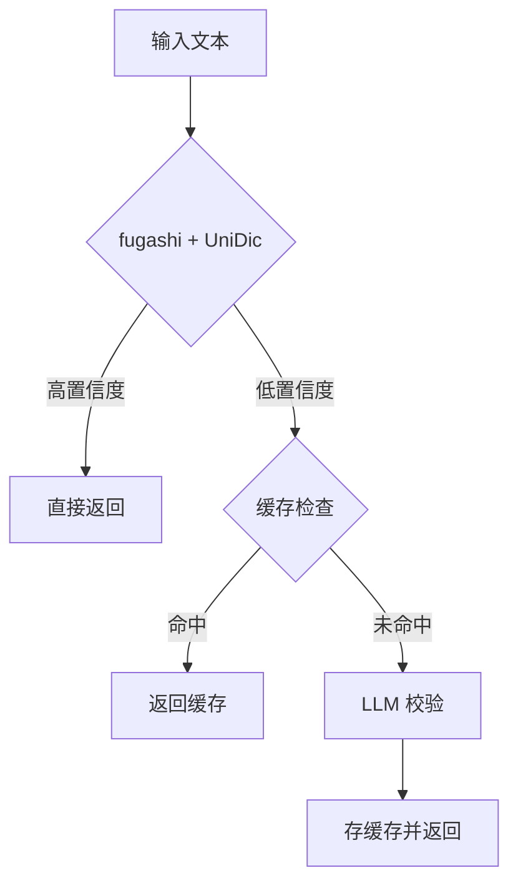

# Japanese Annotator

日语分词注音服务 - 高性能、高准确率的假名标注（振り仮名）API

## 特性

- 🚀 **高性能**: fugashi (Cython MeCab) + Redis 缓存，毫秒级响应
- 🎯 **高准确率**: 三层质量保障（fugashi/UniDic → 缓存 → LLM 校验）
- 📚 **智能词典**: 自动学习，疑难词自动补充
- 🔧 **易部署**: Docker 一键部署，无需编译

## 快速开始

```bash
# 使用 Docker 运行
docker run -p 8080:8080 intellifuture/japanese-annotator:latest

# API 调用
curl -X POST http://localhost:8080/annotate \
  -H "Content-Type: application/json" \
  -d '{"text": "日本語を学習します"}'
```

## 技术栈

- **Python**: 3.11+
- **分词引擎**: fugashi (Cython MeCab wrapper)
- **词典**: UniDic (完整)
- **缓存**: Redis
- **API**: Flask

## 开发

```bash
# 安装依赖
pip install -r requirements.txt

# 下载完整版 UniDic 词典（首次安装）
python -m unidic download

# 运行测试
pytest

# 启动服务
python -m src.main
```

## 自定义人名读音（user.dic）

当词典把人名切分或注音不符合预期（例如 `高市`）时，可以添加 MeCab 用户词典。

1. 创建 `dict/user.csv`（UTF-8）：

```csv
高市,1223,1223,-10000,名詞,固有名詞,人名,姓,*,*,タカイチ,高市,タカイチ,タカイチ
高市早苗,1223,1223,-10000,名詞,固有名詞,人名,一般,*,*,タカイチサナエ,高市早苗,タカイチサナエ,タカイチサナエ
```

2. 编译为 `user.dic`：

```bash
fugashi-build-dict -f utf8 -t utf8 \
  -d "$(python -c 'import unidic; print(unidic.DICDIR)')" \
  -u dict/user.dic dict/user.csv
```

如果提示 `fugashi-build-dict: command not found`，请使用虚拟环境里的可执行文件：

```bash
.venv/bin/fugashi-build-dict -f utf8 -t utf8 \
  -d "$(python -c 'import unidic; print(unidic.DICDIR)')" \
  -u dict/user.dic dict/user.csv
```

3. 加载用户词典：

默认情况下，如果项目下存在 `dict/user.dic`，服务会自动加载。

```bash
python -m src.main
```

如需使用其他路径，可通过环境变量覆盖：

```bash
MECAB_USER_DIC=/path/to/your/user.dic python -m src.main
```

说明：
- `fugashi-build-dict` 是 fugashi 官方提供的 `mecab-dict-index` 包装器。
- 用户词典 CSV 需要与系统词典格式兼容；如果只改少量专有名词，建议先从一个可用条目最小修改。
- fugashi 官方确认用户词典加载方式与 MeCab 一致：`Tagger("-u your_user.dic")`（issue #58）。

## 架构



## License

MIT
