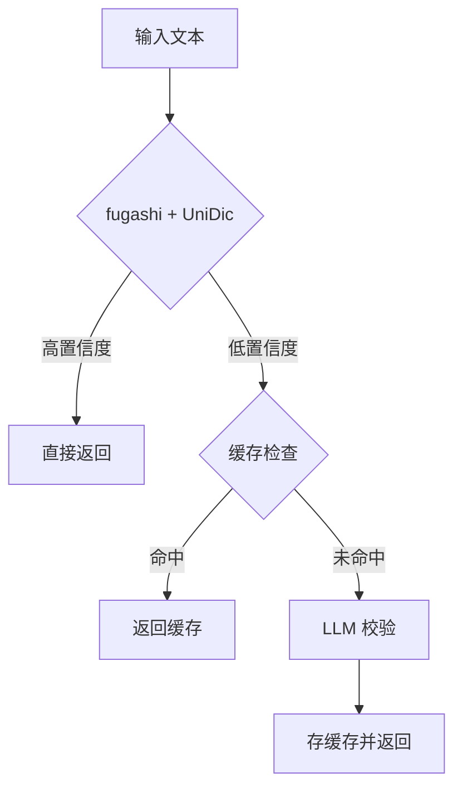

# Japanese Annotator

日语分词注音服务 - 高性能、高准确率的假名标注（振り仮名）API

## 特性

- 🚀 **高性能**: fugashi (Cython MeCab) + Redis 缓存，毫秒级响应
- 🎯 **高准确率**: 三层质量保障（fugashi/UniDic → 缓存 → LLM 校验）
- 📚 **智能词典**: 自动学习，疑难词自动补充
- 🔧 **易部署**: Docker 一键部署，无需编译

## 快速开始

```bash
# 使用 Docker 运行
docker run -p 8080:8080 intellifuture/japanese-annotator:latest

# API 调用
curl -X POST http://localhost:8080/annotate \
  -H "Content-Type: application/json" \
  -d '{"text": "日本語を学習します"}'
```

## 技术栈

- **Python**: 3.11+
- **分词引擎**: fugashi (Cython MeCab wrapper)
- **词典**: UniDic (完整)
- **缓存**: Redis
- **API**: Flask

## 开发

```bash
# 安装依赖
pip install -r requirements.txt

# 下载完整版 UniDic 词典（首次安装）
python -m unidic download

# 运行测试
pytest

# 启动服务
python -m src.main
```

## 架构



## License

MIT
